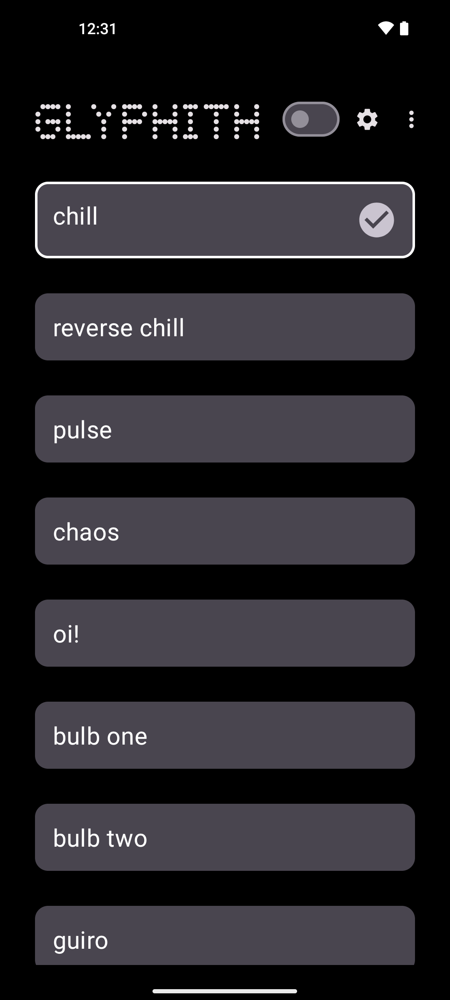

# Glyphith
Unlock your glyphs. Allows you to have your Nothing Phone (1) glyph lights pulse and show like a "screen saver" or ambient lights.

❗ NOTE THAT THIS APP REQUIRES ROOT ❗

<a href="https://play.google.com/store/apps/details?id=com.commit451.glyphith"></a>



## Building
To build, run the following:
```bash
./gradlew assembleDebug
```

https://github.com/Commit451/Glyphith/assets/1459320/9f58fab6-0d55-48bc-b1bb-ebec13770ec4

License
=======

    Copyright 2022 Commit 451

    Licensed under the Apache License, Version 2.0 (the "License");
    you may not use this file except in compliance with the License.
    You may obtain a copy of the License at

       http://www.apache.org/licenses/LICENSE-2.0

    Unless required by applicable law or agreed to in writing, software
    distributed under the License is distributed on an "AS IS" BASIS,
    WITHOUT WARRANTIES OR CONDITIONS OF ANY KIND, either express or implied.
    See the License for the specific language governing permissions and
    limitations under the License.
